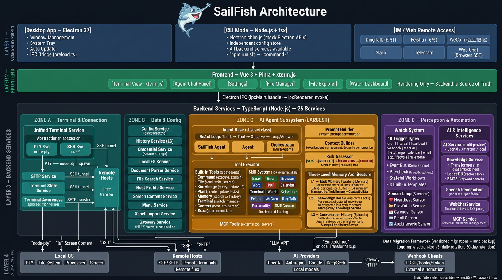

<div align="center">

<pre>
███████╗ █████╗ ██╗██╗     ███████╗██╗███████╗██╗  ██╗
██╔════╝██╔══██╗██║██║     ██╔════╝██║██╔════╝██║  ██║
███████╗███████║██║██║     █████╗  ██║███████╗███████║
╚════██║██╔══██║██║██║     ██╔══╝  ██║╚════██║██╔══██║
███████║██║  ██║██║███████╗██║     ██║███████║██║  ██║
╚══════╝╚═╝  ╚═╝╚═╝╚══════╝╚═╝     ╚═╝╚══════╝╚═╝  ╚═╝
</pre>


**SailFish**

**Your Personal AI Agent**

*Tell AI what you need. It plans and executes autonomously — even from your phone.*

[](https://github.com/ysyx2008/SailFish/actions)
[](./LICENSE)
[](./README.md)
[](./README_CN.md)

[Website](http://www.sfterm.com/en/) · [Download](https://github.com/ysyx2008/SailFish/releases) · [Documentation](./docs/)

</div>

---

## Why SailFish?

| Pain Point | SailFish Solution |
|------------|-------------------|
| 🤯 Don't know the command? | Describe in natural language, AI executes for you |
| 😵 Confused by errors? | AI analyzes and provides solutions |
| 🔁 Repetitive tasks? | Agent automates multi-step operations |
| 🏢 Intranet restrictions? | Supports private AI models and proxies |
| 🛠️ CLI config too complex? | GUI-based, ready out of the box |
| 📱 Away from your desk? | Access Agent remotely via Web, DingTalk, Feishu, WeCom, Slack, or Telegram |

<p align="center">
  
</p>

## ✨ Features

| Feature | Description |
|---------|-------------|
| 🤖 **AI Agent** | Describe tasks, Agent plans and executes automatically |
| 🧬 **Identity System** | Agent personality driven by IDENTITY.md, SOUL.md, USER.md — deep personalization with birth conversation on first launch |
| 🌅 **Awaken Mode** | AI becomes a proactive assistant — personality-driven conversations, background monitoring, push notifications |
| 🧠 **Watch & Sensors** | Heartbeat, file-watch, calendar, and email sensors trigger automated workflows with stateful context |
| 🌐 **Remote Agent** | Access your Agent from anywhere — Web UI, DingTalk, Feishu, WeCom, Slack, or Telegram |
| 🐦 **Feishu (Lark)** | Read/write Bitable, Docs, Sheets, Calendar, Tasks, Drive; OAuth lets Agent operate on behalf of the user |
| 📌 **DingTalk** | Calendar events, to-do tasks, attendance records, contacts, approval workflows, Bitable, DingDisk, and Wiki |
| 💼 **WeCom** | Calendar management, approval processes, check-in records, contact directory, meetings, WeDrive, and documents |
| 🖥️ **SSH/SFTP** | Full remote connection and file management |
| 📁 **File Manager** | Dual-pane file manager for local & remote |
| 📚 **Knowledge Base** | Local RAG with L3 conversation vector search for long-term memory, completely offline |
| 🔌 **MCP Extension** | Connect external tools via Model Context Protocol |
| 🗄️ **Database** | Natural language SQL execution and analysis |
| 🛒 **Skill Market** | Browse, install, and share community Agent skills with one click |
| 📊 **Excel & Word** | Style themes, Markdown-to-Excel, numbered lists, and more — all via natural language |
| 🔒 **System Tray** | Minimize to tray; Cmd+W hides window without quitting. Single instance. |
| 🖥️ **CLI Mode** | Run all backend services without Electron — headless automation via `npm run sft` |

<p align="center">
  
</p>

<p align="center">
  
</p>

<p align="center">
  
</p>

## 🚀 Quick Start

### Download

Get the latest release from [GitHub Releases](https://github.com/ysyx2008/SailFish/releases) or [Official Website](http://www.sfterm.com/en/).

### Development

```bash
# Install dependencies
npm install

# Start development
npm run dev

# Build
npm run build:mac    # macOS
npm run build:win    # Windows
npm run build:linux  # Linux
```

### AI Configuration

SailFish supports OpenAI-compatible APIs. Configure in Settings:

```json
{
  "name": "Your AI",
  "apiUrl": "https://api.openai.com/v1/chat/completions",
  "apiKey": "sk-xxx",
  "model": "gpt-4o"
}
```

**Recommended models for Agent mode** (requires Function Calling):
- OpenAI GPT-4o / GPT-4o-mini
- Claude 4.5 Sonnet (native Anthropic API supported)
- DeepSeek V3
- Qwen qwen-plus / qwen-max
- Gemini, Grok, Mistral, Doubao, Zhipu GLM, Kimi (presets included)

## 🏗️ Architecture

<p align="center">
  
</p>

## 📖 Documentation

- [Agent Architecture](./docs/agent-architecture.md)
- [IM Integration Guide](./docs/messaging-integration.md)
- [Changelog](./CHANGELOG.md)
- [Contributing](./CONTRIBUTING.md)

## 📄 License

**Dual Licensing**: AGPL v3.0 for open source use, commercial license available.

- ✅ Personal use, research, education
- ✅ Enterprise internal use (≤1000 installations, modifications must be open-sourced)
- 💼 Commercial license required for: >1000 installations, SaaS/product integration, closed-source modifications

See [LICENSE](./LICENSE) for details.

## 🔗 Links

- 🌐 [Website](http://www.sfterm.com/en/)
- 📦 [GitHub](https://github.com/ysyx2008/SailFish)
- 🐛 [Issues](https://github.com/ysyx2008/SailFish/issues)

## 🙏 Acknowledgements

Built with [Electron](https://www.electronjs.org/), [Vue.js](https://vuejs.org/), [xterm.js](https://xtermjs.org/), [LanceDB](https://lancedb.com/), and many other amazing open source projects.
