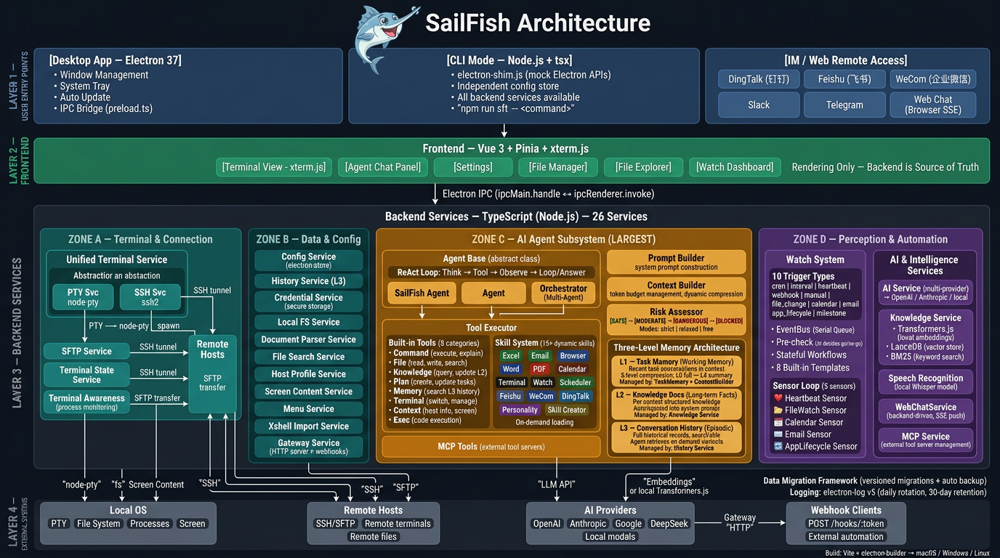

<div align="center">

<pre>
███████╗ █████╗ ██╗██╗     ███████╗██╗███████╗██╗  ██╗
██╔════╝██╔══██╗██║██║     ██╔════╝██║██╔════╝██║  ██║
███████╗███████║██║██║     █████╗  ██║███████╗███████║
╚════██║██╔══██║██║██║     ██╔══╝  ██║╚════██║██╔══██║
███████║██║  ██║██║███████╗██║     ██║███████║██║  ██║
╚══════╝╚═╝  ╚═╝╚═╝╚══════╝╚═╝     ╚═╝╚══════╝╚═╝  ╚═╝
</pre>


**旗鱼 SailFish**

**你的私人桌面秘书**

*不只聊天——它能操作你的电脑，主动盯事找你，还能记住你的许多事*

[](https://github.com/ysyx2008/SailFish/actions)
[](./LICENSE)
[](./README.md)
[](./README_CN.md)

[官方网站](https://www.sfterm.com/) · [下载](https://www.sfterm.com/#download) · [使用文档](https://www.sfterm.com/docs/getting-started/what-is-sailfish/) · [技能市场](https://www.sfterm.com/skills/)

需自行配置大模型 API · macOS / Windows

</div>

---

## 为什么是秘书，不只是工具

旗鱼不是被动等指令的聊天机器人，而是住在你电脑里的**私人秘书**——有自己的节奏，能主动监控和找你，记得住你是谁、上次聊过什么，并且能真正动手操作。

| 痛点 | 旗鱼的做法 |
|------|---------|
| 纯聊天 AI 只会说不会做 | 秘书能运行命令、读写文件、操控浏览器、收发邮件、做文档 |
| 每次对话都从零开始 | 三层记忆 + 知识库：认识你、能回忆、档案室按需取用 |
| 需要你主动守着 | 觉醒 + 关切：秘书自己监控、定时执行、主动通知 |
| 只能坐在电脑前 | 微信、钉钉、飞书、企微、Slack、Telegram、网页，随时联络同一位秘书 |
| 不会写命令、看不懂报错 | 用自然语言描述，秘书规划步骤并执行；危险操作会先问你 |
| 内网 / 离线 | 支持私有化模型、本地 Ollama、代理 |

<p align="center">
  
</p>

## 两种用法，一个工作台

| 入口 | 关系 | 特点 |
|------|------|------|
| **任务** | 你支使秘书完成具体工作 | 一次性、可并行、彼此隔离；桌面端主力。进行中也能把下一句排进队列 |
| **联络** | 你与秘书的持续关系线 | 常驻、多渠道汇流；秘书也能主动找你 |

桌面以任务为主。所有 IM 渠道汇入同一条联络线，秘书不会「换个人」。

主界面是三栏：左边进新对话、联络、终端和最近会话；中间做当前这件事；右边是产出物，收起来就不占地方。关切、待办各自有独立面板。

## 核心能力

### 记得你，也能想起来

| 能力 | 说明 |
|------|------|
| 🧬 **身份与人格** | 秘书有自己的性格；首次启动有诞生对话，越用越像「你的」秘书 |
| 🧠 **三层记忆** | 认识你的习惯与事实；完整经历按需回忆；知识库是交给秘书的档案室 |
| 📚 **知识库** | 文档本地入库、按需检索；数据留在你的电脑上 |

### 真的上手干活

| 能力 | 说明 |
|------|------|
| 🖥️ **本地 & SSH 终端** | 操作本机与远程服务器；远程会话也能直接动本机文件和命令；分屏可混用本地和多台主机；断线可重连 |
| 👥 **子智能体** | 可同时派几个人干活，做完回来汇报，还能再交代 |
| 📁 **文件管理** | 双栏管理本地与远程文件，拖拽传输 |
| 🌐 **浏览器助手** | 接管已打开的 Chrome / Edge / Firefox，保留登录态 |
| 📦 **产出物** | Markdown 所见即所得、HTML/网页实时预览、截屏追问、发到手机；Word / Excel / PDF / WPS 都能打开看 |
| 💻 **编程** | 打开本机项目改代码、检查语法、按轮撤回；默认关闭，高级用户可自行启用 |
| 🛡️ **安全确认** | 命令分级评估；危险操作先问你；执行模式可调（严格 / 宽松 / 全自动），也可选「替我审批」 |

### 秘书本职

| 能力 | 说明 |
|------|------|
| ✅ **待办** | 本地待办：到期提醒、按重要程度排序；可直接交给新任务去办 |
| 📧 **邮件** | 读、搜、写、回；Gmail / Outlook / QQ / 163 等 |
| 📅 **日历** | Google / iCloud / Outlook / CalDAV，用自然语言管日程 |
| 📊 **办公文档** | Word、Excel、可编辑 PPT、图表、PDF；也支持公文体例与 WPS 格式 |
| 🐦 **飞书 / 钉钉 / 企微** | 日历、待办、审批、文档、多维表格等企业办公技能 |

### 它也会来找你

| 能力 | 说明 |
|------|------|
| 🌅 **觉醒** | 秘书按自己的节律运转，该开口时主动联系你 |
| 👁️ **关切** | 心跳、文件变化、日历、邮件、Webhook 等触发；独立运维面板，一眼看到有没有出事 |
| 💬 **多渠道联络** | 微信扫码即可、钉钉、飞书、企微、Slack、Telegram、网页远程——汇入同一位秘书 |
| 🔊 **语音** | 回复可朗读；语音识别按需下载，不装也不撑大安装包 |

### 可增长，可自用

| 能力 | 说明 |
|------|------|
| 🛒 **技能市场 & 插件** | 社区技能一键安装；插件可扩展工具、模型服务商、IM 渠道 |
| 🔌 **连接器（MCP）** | 接入数据库、API 等外部工具；启用即连，按需加载 |
| 🔍 **网页搜索** | 博查、智谱、Kimi、Tavily、Google、Jina 等 |
| 🖥️ **命令行** | `sailfish` 无头跑完全部后端；可与桌面共用数据，也可用沙箱隔离 |
| 💾 **数据** | 整包备份与恢复；数据目录可迁到其他磁盘；崩溃后可复制脱敏摘要 |
| 🔒 **常驻** | 系统托盘、开机启动，秘书一直在 |

<p align="center">
  
</p>

<p align="center">
  
</p>

<p align="center">
  
</p>

## 快速开始

### 下载安装

从 [官方网站](https://www.sfterm.com/#download) 或 [GitHub Releases](https://github.com/ysyx2008/SailFish/releases) 下载最新版。国内建议走官网阿里云节点。

| 平台 | 要求 | 安装包 |
|------|------|--------|
| **macOS** | 10.15+，Intel 与 Apple Silicon | `.dmg`（按芯片选择 arm64 / x64） |
| **Windows** | Windows 10 / 11，Server 2016+ | NSIS 安装包，另有 **ZIP 便携版** |

Linux 桌面版暂不提供官方下载。Windows 上若安装程序无法运行（如部分 Server 2016），用 ZIP 解压即可。

macOS 首次打开若提示无法验证开发者：系统设置 → 隐私与安全性 →「仍要打开」，或执行 `xattr -cr /Applications/SailFish.app`。

### 配置 AI

旗鱼不内置大模型，需要你自己准备 API（像给车加油）。设置页有一键预设，支持同时配多个、随时切换。

```json
{
  "name": "日常 DeepSeek",
  "apiUrl": "https://api.deepseek.com/chat/completions",
  "apiKey": "sk-xxx",
  "model": "deepseek-v4-flash-vision-exp"
}
```

**推荐模型**（需支持 Function Calling）：

- **日常**（快、省、够用，也能看图）：DeepSeek V4 Flash Vision · Qwen 3.7 Plus · Claude Sonnet 5 · Gemini 3.7 Flash
- **复杂任务**（长推理、多步骤）：DeepSeek V4 Pro · GPT-5.6 · Claude Opus 5 · Grok 4.6
- **视觉**（截图、识图、扫描件）：DeepSeek V4 Flash Vision（默认就够）· 豆包 Seed 2.1 · Qwen 3.7 Plus · GPT-5.6 · Gemini 3.7 Flash · Claude Sonnet 5
- **本地离线**：Ollama（预设 `qwen3.5:9b`；窗口较小的模型做多步任务会吃力）
- **更多**：智谱 GLM-5.3、Kimi K3、MiniMax M3、Mistral Large，以及任何 OpenAI 兼容接口

纯文本模型可以关联一个视觉模型：遇到图片时自动转过去，说完再回来。网页搜索在国内可用博查、智谱或 Kimi。手把手见 [首次配置](https://www.sfterm.com/docs/getting-started/first-setup/)。

### 开发调试

```bash
npm install
npm run dev              # 开发模式
npm run build:mac        # 打 macOS 包
npm run build:win        # 打 Windows 包
npm run test             # 单元测试
bash electron/cli/test-cli.sh --no-ai   # CLI 回归（不调模型）
```

> **开发版 Windows 安装包**（仅供作者跨平台测试）：本地执行 `npm run build:win:remote` 触发 GitHub Actions，约 8–10 分钟后覆盖到固定 OSS 路径，不保证稳定。
> <https://sfterm-download.oss-cn-wuhan-lr.aliyuncs.com/dev/SailFish-Setup-dev.exe>

贡献方式见 [CONTRIBUTING.md](./CONTRIBUTING.md)。日常开发在 `develop` 分支，PR 请打到 `develop`，不要打到 `main`。

## 命令行

装机后可在「设置 → 数据管理」安装 `sailfish` 命令；开发态也可用 `npm run sailfish` 或 `npm run install:cli`。

```bash
sailfish "列出当前目录下的 markdown 文件"
sailfish --sandbox "试跑，别动桌面真实数据"
sailfish models
sailfish --help
```

默认与桌面共用数据，高危操作需确认（`--mode relaxed`）。`--sandbox` 会隔离运行时数据，仍借用桌面的模型配置和凭据。`--mode free` / `--free` 才全自动，请谨慎。

从仓库直接跑时，默认进沙箱，避免污染桌面真实历史。

## 系统架构

<p align="center">
  
</p>

桌面（Electron）与命令行共用同一套后端。前端只负责呈现；会话、记忆、工具执行以后端为准。远程渠道（IM / 网页）也走这条后端，不是另起一个机器人。

## 文档

**给使用者**

- [什么是旗鱼](https://www.sfterm.com/docs/getting-started/what-is-sailfish/)
- [下载与安装](https://www.sfterm.com/docs/getting-started/installation/)
- [使用指南](https://www.sfterm.com/docs/)
- [技能市场](https://www.sfterm.com/skills/)
- [数据安全](https://www.sfterm.com/data-privacy/)
- [更新日志](./CHANGELOG.md) · [官网更新说明](https://www.sfterm.com/changelog/)

**给开发者与集成方**

- [Agent 工作原理](./docs/agent-architecture.md)
- [IM 集成指南](./docs/messaging-integration_CN.md)
- [插件开发](./docs/plugin-dev-guide.md)
- [贡献指南](./CONTRIBUTING.md)

## 许可证

**双许可**：开源使用遵循 AGPL v3.0，商业使用需授权。

- ✅ 个人使用、学习研究
- ✅ 教育机构、医疗机构、非盈利组织
- ✅ 企业内部使用（≤1000 套，修改需按 AGPL 开源）
- 💼 需商业授权：超过 1000 套、SaaS / 嵌入产品、闭源修改、改 Logo / 名称、去掉「支持作者」

详见 [LICENSE](./LICENSE)。

## 相关链接

- 🌐 [官方网站](https://www.sfterm.com/)
- 📦 [GitHub](https://github.com/ysyx2008/SailFish)
- 🐛 [问题反馈](https://github.com/ysyx2008/SailFish/issues)
- 💬 QQ 交流群：`1078041072`

## 致谢

基于 [Electron](https://www.electronjs.org/)、[Vue.js](https://vuejs.org/)、[xterm.js](https://xtermjs.org/)、[LanceDB](https://lancedb.com/) 等优秀开源项目构建。
